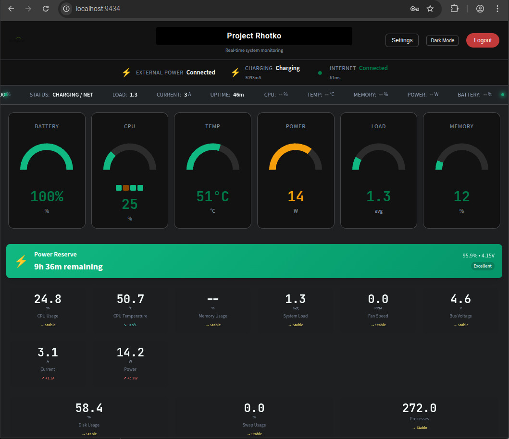

  

  

# X1200 Power Monitor Dashboard

Your lightweight control center for Geekworm X1200/X1206 UPS builds. It surfaces live power metrics, network health, and bypass server telemetry for remote edge boxes.

## Highlights
- Real-time gauges for battery, CPU, thermal and power draw.
- Built-in bypass notifier with Pushover hooks and health heartbeats.
- Smart voltage fallback scripts to protect Pi sensors (see `setup-voltage-monitoring.sh`).
- Mobile-friendly UI that runs happily on headless Chromium or kiosk screens.

## Quick Start
1. `sudo ./install.sh` – installs Python deps and the `power-dashboard.service` unit.
2. Point a browser at `http://<pi-ip>:9434` for the live dashboard.
3. Use the Settings panel to tune alerts, gauge sizing, and bypass endpoints.

## Key Files
- `dashboard_server.py` – Flask app/API powering the UI.
- `x1200_common.py` – shared MAX17040/X1200 hardware helpers.
- `setup-voltage-monitoring.sh` – smart voltage source selector service.

For deeper troubleshooting or feature history, skim `VOLTAGE_MONITORING_UPDATE.md`, `COMPLETE_FEATURE_ANALYSIS.md`, and the scripts in this repo.
